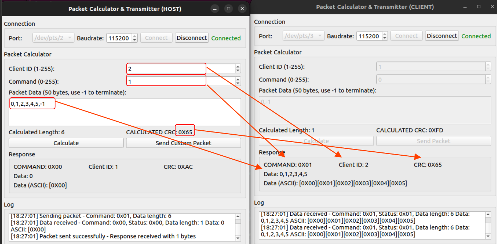

# H6X Dynamic Serial Interface Demo

## Overview

This demo demonstrates the H6X Dynamic Serial Interface protocol using the packet calculation GUI tool. The demo creates a virtual serial interface connection between two instances of the packet_calc_gui application - one acting as a host and another as a client.

## Prerequisites

### System Requirements
- ROS 2 Humble or later
- socat (for virtual serial port creation)

### Installation

ROS 2 package dependencies must be installed before running the demo. The following commands will install the necessary dependencies and build the application:

```bash
source /opt/ros/humble/setup.bash

mkdir -p ~/ros2_ws/src
cd ~/ros2_ws/src
git clone https://github.com/HarvestX/h6x_dynamic_serial_interface.git

cd ~/ros2_ws/
rosdep install -y --from-paths . --ignore-src

colcon build --symlink-install
source install/setup.bash
```

Install `socat` if not already installed:

```bash
sudo apt install -y socat
```

## Demo Setup

### Step 1: Create Virtual Serial Port Pair

Create a virtual serial port pair using socat:

```bash
# Create virtual serial port pair
socat -d -d pty,raw,echo=0 pty,raw,echo=0
```

This command will output something like:
```
2025/01/15 10:30:45 socat[12345] N PTY is /dev/pts/2
2025/01/15 10:30:45 socat[12346] N PTY is /dev/pts/3
```

Note the two PTY devices (e.g., `/dev/pts/2` and `/dev/pts/3`) - these will be used for the host and client connections.

### Step 2: Launch Host Application

In a new terminal, launch the host instance:

```bash
cd ~/ros2_ws/
source install/setup.bash

ros2 run h6x_dynamic_packet_tools packet_calc_gui --ros-args -p role:="host" -p port:="/dev/pts/2"
```

**Configuration:**
1. Select the first virtual port (e.g., `/dev/pts/2`) from the Port dropdown
2. Set baud rate to 9600 (default)
3. Click "Connect" to establish connection
4. The connection status should show "Connected" in green

### Step 3: Launch Client Application

In another terminal, launch the client instance:

```bash
cd h6x_dynamic_packet_tools/build
./packet_calc_gui --ros-args -p role:="client" -p port:="/dev/pts/3"
```

**Configuration:**
1. Select the second virtual port (e.g., `/dev/pts/3`) from the Port dropdown
2. Set baud rate to 9600 (default)
3. Click "Connect" to establish connection
4. The connection status should show "Connected" in green

## GUI Interface Guide



### Connection Panel
- **Port**: Select virtual serial port
- **Baud Rate**: Communication speed (default: 9600)
- **Connect/Disconnect**: Establish/terminate connection
- **Status Indicator**: Green (Connected) / Red (Disconnected)

### Packet Calculator Panel
- **Client ID**: Target device identifier (1-255)
- **Command**: Command code to send (0-255)
- **Packet Data**: Comma-separated data bytes
- **Calculated Length**: Automatically computed data length
- **Calculated CRC**: CRC-8 checksum for error detection

### Response Panel
- **Mode**: Response packet mode indicator
- **CRC**: Received CRC value
- **Data**: Raw numeric data received
- **Data (ASCII)**: ASCII interpretation of received data

### Log Panel
- Real-time communication log with timestamps
- Packet transmission confirmations
- Error messages and status updates
